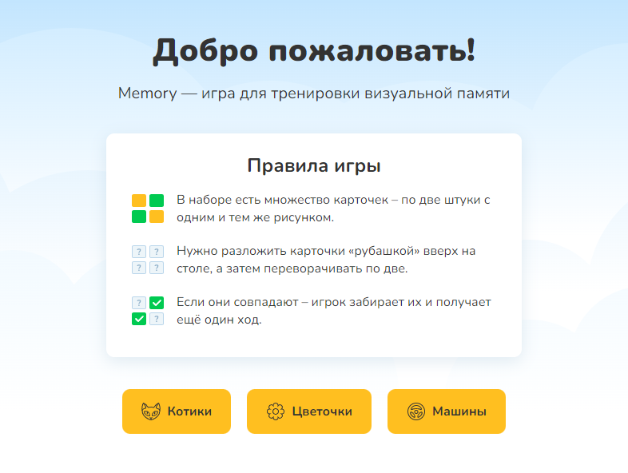
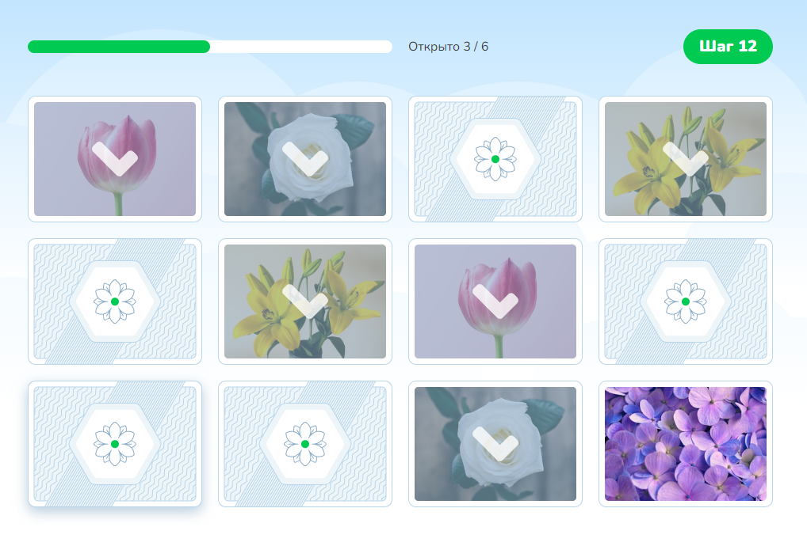
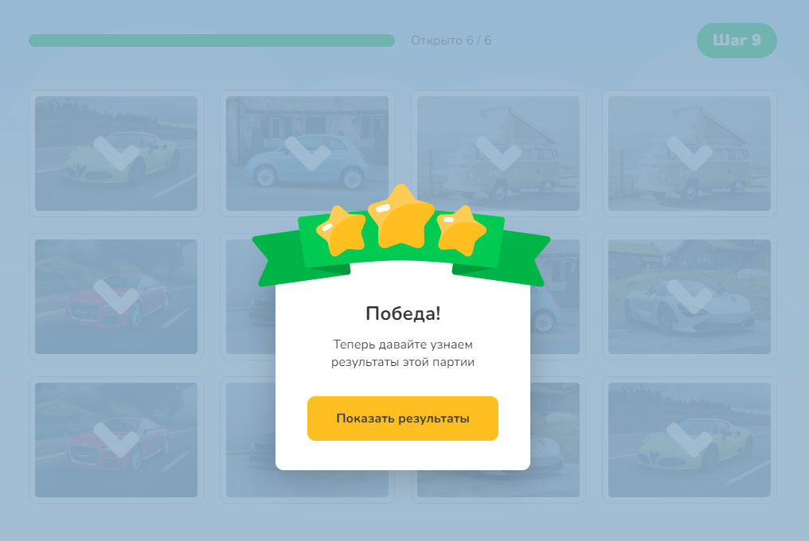
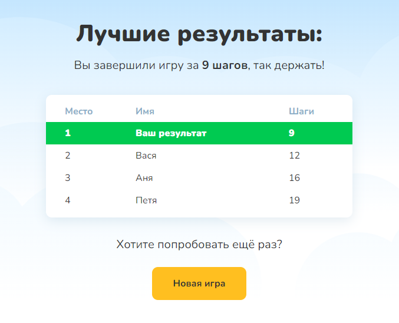

# Ппроект «Memory». Html-academy

#### Ссылка на Vercel:

#### Stack:

- React
- CSS

#### Начальный экран отображает правила игры и позволяет выбрать тему изображений на карточках:

#### При клике на кнопку выбора темы изображений пользователь переходит к экрану игры с выбранным комплектом карточек:

#### Когда все карточки собраны в пары, пользователь видит модальное окно (popup) с сообщением об окончании игры и кнопкой перехода к экрану результатов. Переход к следующему экрану происходит после нажатия на кнопку

#### Экран результатов. Результаты игры других пользователей поступают из внешнего источника данных (файла)

